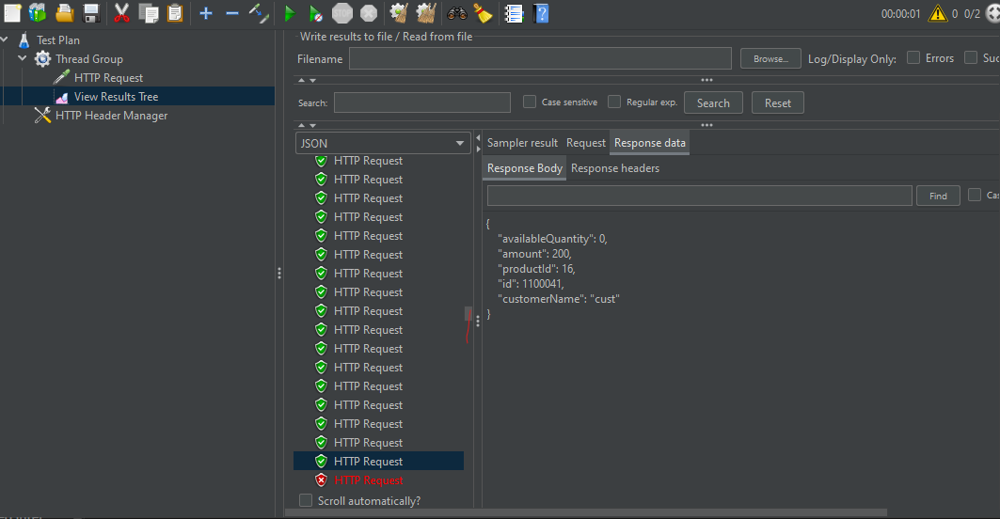
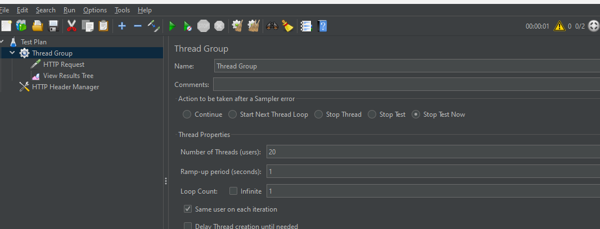

# Phase 1 - Baseline Performance Metrics (OFFSET Pagination)

## 1. Problem Definition

Fetching orders in a read-heavy system can become slow as data grows. 
Returning large datasets in a single request causes:

* High latency
* Possible timeouts
* Poor user experience

**Goal:** Build a simple baseline system to measure raw CRUD performance before any optimization.

---

## 2. Dataset

* Total orders seeded: **1,000,000 rows**
* Each order contains:

    * `id` (primary key)
    * `customerName` (string)
    * `amount` (BigDecimal)
* Spring Boot + JPA + MySQL backend
* SQL logging enabled (`show-sql`, `hibernate.SQL=DEBUG`)

---

## 3. Endpoints Implemented

| Endpoint       | Method | Description                                   |
| -------------- | ------ | --------------------------------------------- |
| `/orders`      | POST   | Create a new order                            |
| `/orders/{id}` | GET    | Get order by ID                               |
| `/orders`      | GET    | List orders with pagination (`page` & `size`) |

---

## 4. Baseline Latency Measurements

* Pagination: `page = 0, 1000, 10000, 50000, 100000`
* Page size: 10 rows
* Latency measured by **4 hits per page**, average calculated

| Page    | Offset    | Avg Latency (ms) |
| ------- | --------- | ---------------- |
| 0       | 0         | 105.5            |
| 1000    | 10,000    | 106              |
| 10,000  | 100,000   | 155.75           |
| 50,000  | 500,000   | 436.75           |
| 100,000 | 1,000,000 | 896.5            |

**Observations:**

* Small pages (0–10k) perform well (~105ms)
* Latency starts increasing significantly after 100k offset
* Page 100,000 (~1M rows) shows **OFFSET pagination problem** → almost 900ms

> This baseline highlights why **pagination optimization, indexing, and keyset/cursor pagination** are needed.

---

## 5. SQL Queries Observed

**Example for paginated query:**

```sql
select
    o1_0.id,
    o1_0.amount,
    o1_0.customer_name
from
    orders o1_0
order by
    o1_0.id
limit ?, ?;
```

* `?` = offset, page size
* Observed `count(*)` query executed automatically by Spring Data JPA

---

## 6. Conclusion

* Baseline established with **1M rows**
* OFFSET pagination shows **poor scalability at high offsets**


# Phase 2 — Optimized Performance Metrics (Keyset Pagination)

## 1. Optimization Summary

* Switched OFFSET pagination → keyset pagination using `lastId` as cursor
* Added index on `id` (primary key) — already exists
* Measured performance with same page size (10 rows) and same dataset

---

## 2. Latency Measurements (Keyset Pagination)

| Last ID | Avg Latency (ms) |
| ------- | ---------------- |
| null → 0 | 9                |
| 10,000   | 8.75             |
| 100,000  | 7.75             |
| 500,000  | 7.25             |
| 1,000,000| 8.75             |

**Observations:**

* Latency is **constant (~7–9ms)**, regardless of data size
* Keyset pagination avoids scanning rows unnecessarily → **index-friendly**
* * Query count reduced from **2 → 1 per request** compared to OFFSET pagination, reducing DB load
* Compared to OFFSET: huge improvement at high offsets (OFFSET: 896ms vs Keyset: 8.75ms at ~1M rows)

---

## 2a. Load Test (50–100 RPS)

* Test setup: 100 requests, sequential hits, measured total duration
* Total duration: 11.737 seconds
* Average latency per request: ~7 ms

**Observation:**

* Keyset pagination maintains low latency even under small load (50–100 RPS)
* Confirms that optimization works not just in single queries but in repeated requests


## 3. Conclusion

* Optimization **dramatically improves scalability** for large datasets
* Keyset/cursor pagination is **simple and effective** for read-heavy APIs
* Maintains consistently low latency, even under small loads (50–100 RPS)
* Current queries do not exhibit N+1 problems. Future optimizations may address N+1 issues if JOINs are introduced.

---

# Phase 3 - Transactions & Concurrency Safety

## 1. Problem Definition

* In a concurrent order creation scenario, multiple users may attempt to purchase the same product at the same time.
* Without proper concurrency control, this can lead to:
* Race conditions
* Incorrect stock updates
* Overselling (double booking)
* Partial writes (stock updated but order not created)

**Goal:** Ensure data consistency and correctness when multiple concurrent requests attempt to create orders for the same product.

---

## 2. Initial Implementation (Without Concurrency Control)

**Logic flow:**
1. Fetch product by productId
2. Check availableQuantity > 0
3. Decrease quantity
4. Save product
5. Create and save order

**Issues observed:**
* if (availableQuantity > 0) check is **not concurrency-safe**
* Multiple threads read the same quantity before updates occur
* Results were inconsistent under concurrent access

---

## 3. Concurrency Control Applied

# 3.1 Transaction Management

* Added @Transactional at the service layer for order creation
* Ensures:
  * All DB operations (product update + order save) execute atomically
  * Any failure rolls back the entire operation

# 3.2 Optimistic Locking

* Added @Version field to Product entity
* Hibernate generates SQL similar to:
  `UPDATE product
   SET available_quantity = ?, version = version + 1
   WHERE id = ? AND version = ?;`
* Prevents concurrent updates on stale data
* Only one thread can successfully update a product version at a time

---

## 4. Concurrency Testing Setup

* Tool used: **Apache JMeter**
* Same product ID used across all requests
* Artificial delay (Thread.sleep(100ms)) added between:
  * Quantity check
  * Product save
    - to force thread overlap
* Thread counts tested: **3, 5, 10, 20**


---

## 5. Test Results

| Available Quantity | Threads | Successful Orders | Failed Requests                    |
| ------------------ | ------- | ----------------- | ---------------------------------- |
| 3                  | 3       | 3                 | 0                                  |
| 3                  | 5       | 3                 | 2 (Out of stock / optimistic lock) |
| 3                  | 10      | 3                 | 7                                  |
| 3                  | 20      | 3                 | 17                                 |

**Observations:**
* Stock never went below zero
* No duplicate orders were created for the same stock unit
* Failed requests were rejected safely
* Optimistic locking prevented concurrent overwrites
* Transactional boundary ensured no partial updates

---

## 7. Conclusion
* Implemented safe order creation using **transactional control + optimistic locking**
* Validated correctness using controlled multithreaded simulations
* System now guarantees:
  * No overselling
  * Consistent stock updates
  * Reliable failure handling under concurrent load
